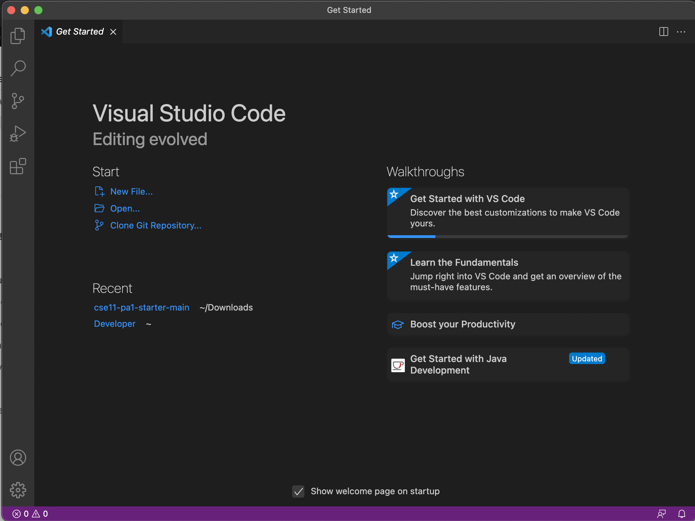
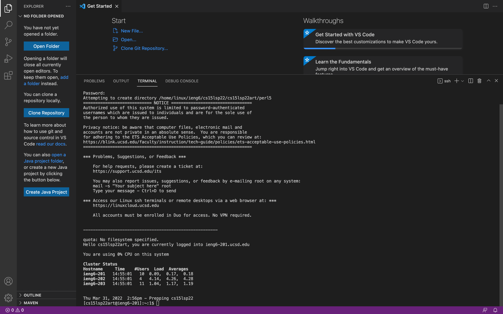
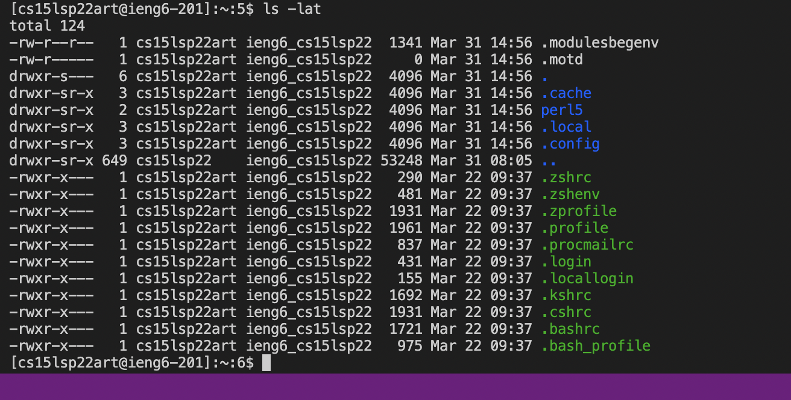
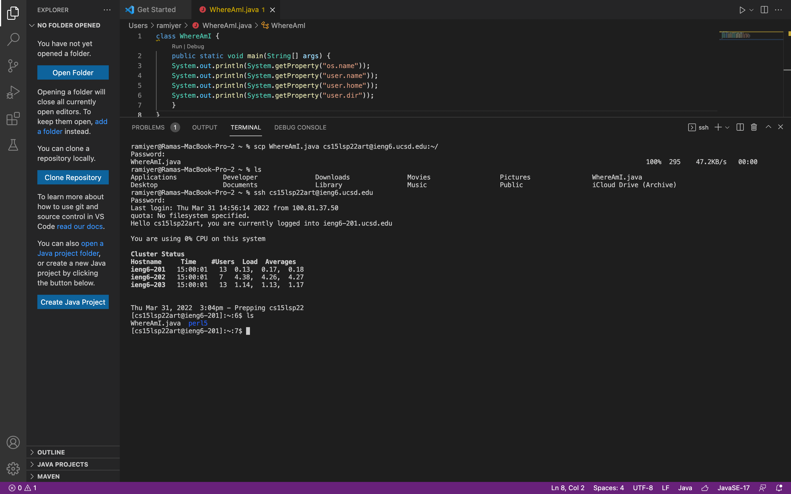
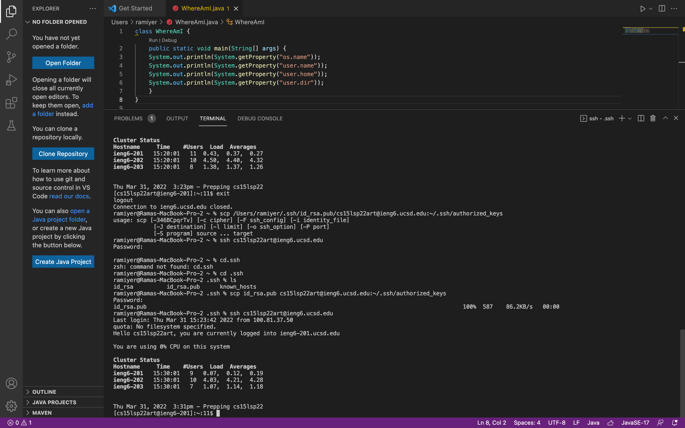
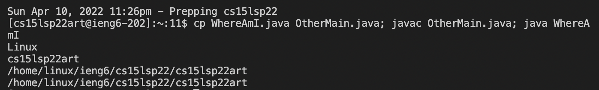

# Welcome to CSE 15L - Software Tools & Technology

## I am going to teach you how to complete the first lab :)


##Installing VSCode
You should go to the [Visual Studio website](https://visualstudio.microsoft.com/downloads/) and download Visual Studio. Once you have it downloaded, go ahead and open the IDE. It should looks something like this:



##Remotely Connecting
Now that you have VS Code installed and running, you are going to try remotely connecting to the servers that we have here. Since I am on a Macbook Pro, I will show you how to do this on MacOS. Assuming you know your course specific account for CSE 15L, open a new terminal in VS Code, using Ctrl + ', or clicking on Terminal -> New Terminal. You're going to type `$ ssh cs15lsp22zz@ieng6.ucsd.edu` replacing the "zz" with whatever your specific account code is. You will be asked to input your password (which you created when looking for your course specific account). After doing so, your terminal should look something like this:



Congratulations! You're now connected to the remote server.


##Trying Some Commands
Now you can go ahead and run some commands and see how it performs when connected to the server. Some examples of commands you can run are `cd ~`, `cd`, `ls -lat`, and `ls -a`. In my example below, I tried using `ls -lat`:




##Moving Files with `scp`
Now let's try somethink funky! We're going to try moving files over SSH with scp. Essentially, what scp does is it copies files from your computer to a remote computer. To do this, we're going to create a file called `WhereAmI.java`, in which we are going to input the following code:

```
class WhereAmI {
  public static void main(String[] args) {
    System.out.println(System.getProperty("os.name"));
    System.out.println(System.getProperty("user.name"));
    System.out.println(System.getProperty("user.home"));
    System.out.println(System.getProperty("user.dir"));
    }
}
```

Now, using the terminal, run the command `scp WhereAmI.java cs15lsp22zz@ieng6.ucsd.edu:~/`, which will copy the file you made on your computer to the account on the remote server. Just like before, it will ask you to enter your password, and your terminal should look like this:




##Setting an SSH Key
Now we're going to learn how to run commands without having to log in every time. We can do this by setting an SSH key. The way SSH keys work is that they create a file in your local system that acts as the key for every time the remote server asks you to log in.

We start off by typing `$ ssh-keygen` into the terminal. The output will prompt you to enter the passphrase, but we can just hit enter, which will keep it as an empty/no passphrase. Your key should now be set up and look something like this:




##Optimizing Remote Running
Almost there! We're now going to omptimize remote running. We can make this process easier by using semicolons to run multiple commands on the same line. An example of this is using `$ cp WhereAmI.java OtherMain.java; javac OtherMain.java; java WhereAmI`. If you try the command mentioned, then it should look like this:



And with that, you're now a pro at remote access. Go have some fun!
