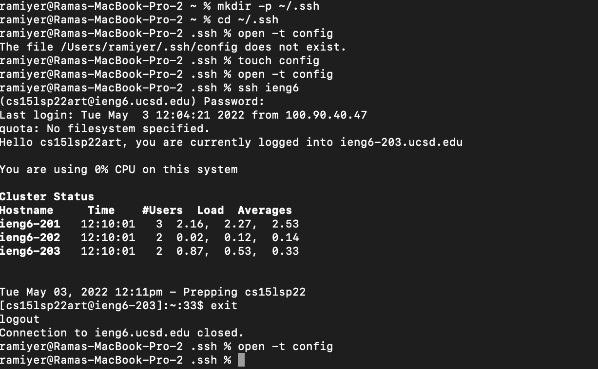
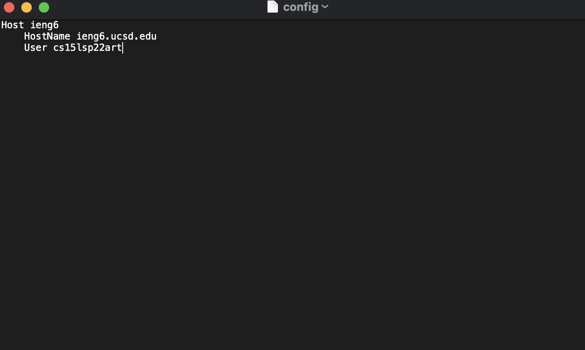
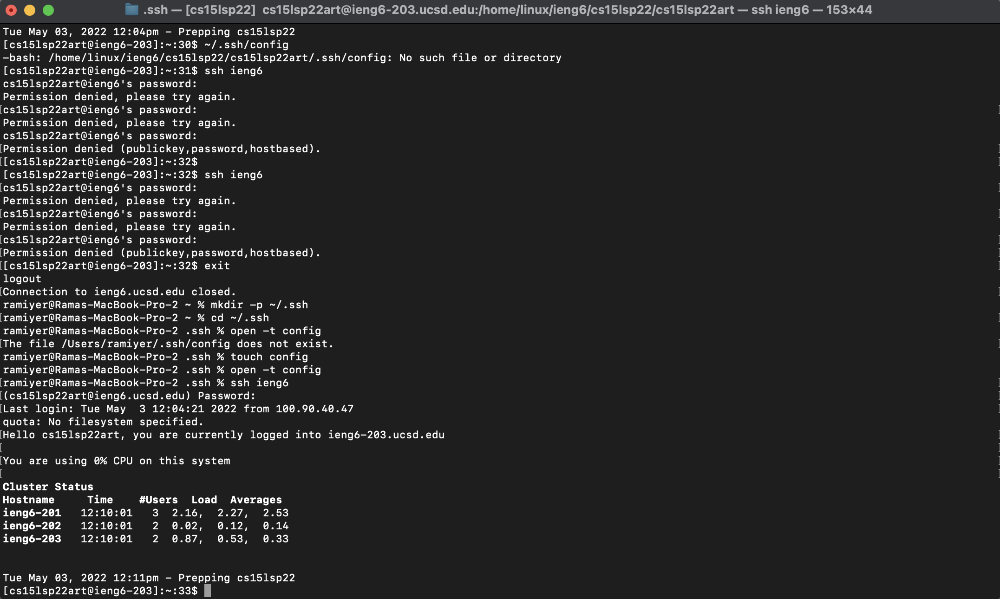
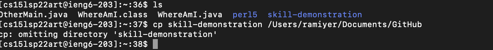
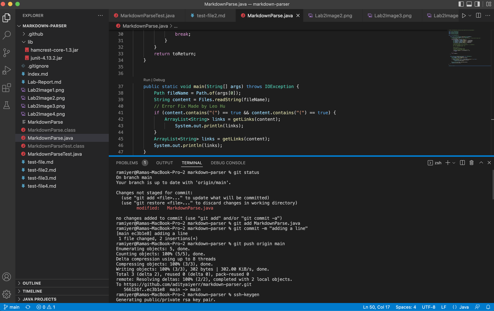
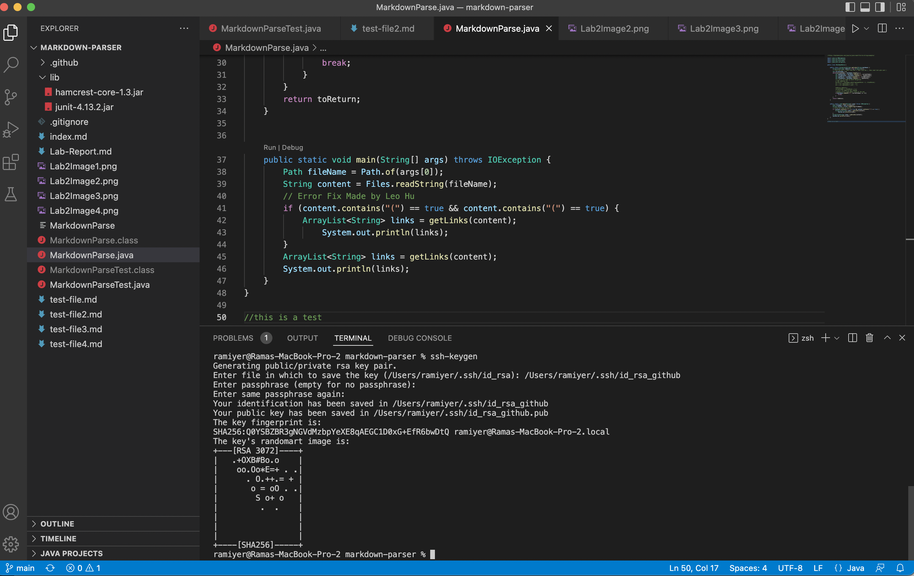
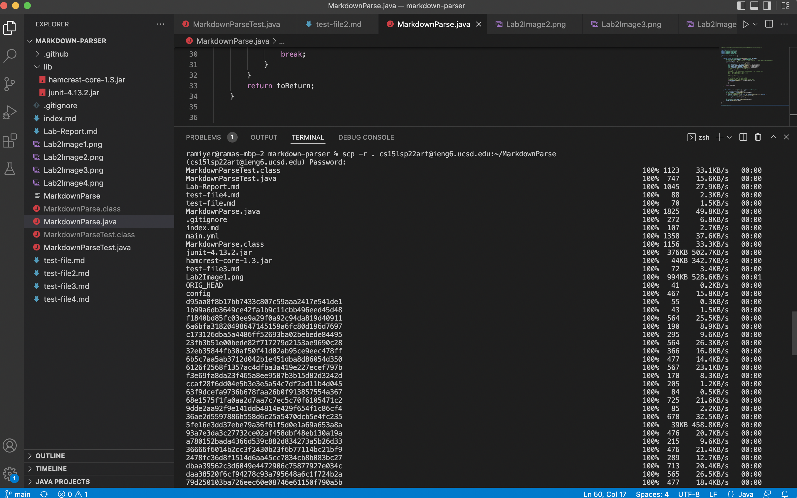
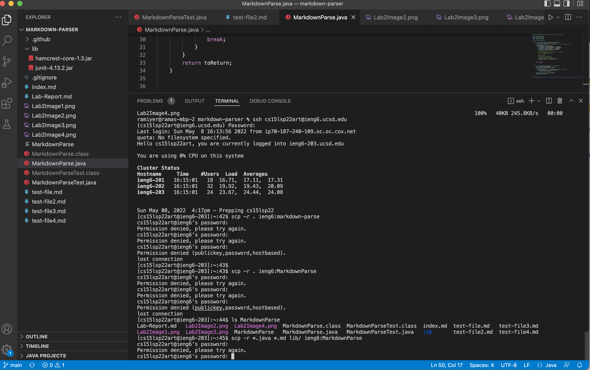

# Week 6 Lab Report 3

## Show your .ssh/config file, and how you edited it (with VScode, another program, etc)

### Here, I used a couple of commands (reference Image 1) which I used to open my config file. Then, using a text editor, I wrote a few lines of code provided in our lab instructions (reference Image 2).

## Show the ssh command logging you into your account using just the alias you chose.

### Then, I used another command (ssh ieng6), as given in the lab instructions, which allowed me to log into the system without having to enter the entire remote login email (cs15lsp22art@ieng6.ucsd.edu).

## Show an scp command copying a file to your account using just the alias you chose.

### The scp command I used to copy a file to my account was cp, where I chose skill demonstration and then the location in which I wanted to copy the file to. I initally used ls to see which files I had in my remote account.

## Show where the public key you made is stored on Github and in your user account (screenshot).

### The image shows the public key I made, using instructions provided in the first lab instructions, where I used keygen to create a key on Github. (Reference Image 5)

## Show where the private key you made is stored on your user account (but not its contents) as a screenshot.

### This image shows the private key I made, which is saved on my local system, that I set up using the keygen command as provided in the first lab instructions. (Reference Image 6)

## Show running git commands to commit and push a change to Github while logged into your ieng6 account.

### The following commands I used (commit and push) were used to add a line to MarkdownParse.java, where I added a line, then commited it to github desktop, and finally pushed it to the origin.

## Show a link for the resulting commit.
[Commit](https://github.com/adityaiyerr/markdown-parser/commit/ec3b1e831d20b3368839bd6f779c12519afcc41b)

## Show copying your whole markdown-parse directory to your ieng6 account.

### Using scp -r, I was able to copy the entire MarkdownParse directory onto my remote account, as shown in the image below (Reference Image 8)

## Show logging into your ieng6 account after doing this and compiling and running the tests for your repository.

## Show (like in the last step of the first lab) combining scp, ;, and ssh to copy the whole directory and run the tests in one line.

### The image below shows the actions of the previous two steps. I log into the ieng6 account, then use scp to combine multiple tests into one line. This ends up not working, because of some weird bug causing my password to fail, even though I made sure that the password was correct. However, regardless of this issue, the terminal shows the concepts that I employed.

