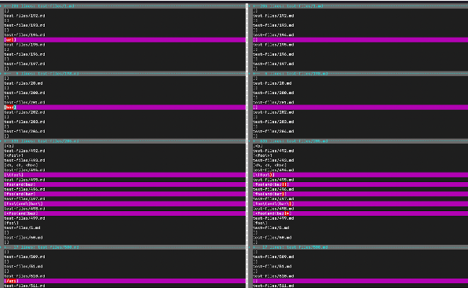

## Lab Report 5

# I found the tests with different results using the vimdiff command.

As shown in Lab 9, the following ahs an example of what the vimdiff command looks like.

# [Test 201.md](https://github.com/nidhidhamnani/markdown-parser/blob/main/test-files/201.md)
