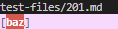

## Lab Report 5

# I found the tests with different results using the vimdiff command.

As shown in Lab 9, the following ahs an example of what the vimdiff command looks like.

# [Test 201.md](https://github.com/nidhidhamnani/markdown-parser/blob/main/test-files/201.md)

For Test 201, my implementation was correct, outputting `[]` , while the provided implementation outputted `[baz]`. Using VSCode preview, I know that there should be no link showing in the output, because there are no links in the actual test file.

The outputs of both files can be seen here, with my implementation showing a `[]` while the given implementation showing `[baz]`, with the expected output being `[]`.

VSCode preview shows what it should produce:

The provided implementation recognized the open and closing parentheses and assumed that the contents inside were a link. However, this was not the case for test 201. A fix for this problem would be to make the implementation check for the closing bracket and opening parenthesis right after one another and then look for the closing parenthesis to make sure that there are characters (that aren't white spaces) between the closing bracket and opening parenthesis.

# [Test 14.md](https://github.com/nidhidhamnani/markdown-parser/blob/main/test-files/14.md)

For Test 14, my implementation was correct, outputting `[]`, while the provided implementation outputted `[foo]`. Using VSCode preview, I know that there should be no link outputted because there are no links within the test file itself.

The outputs of both files are shown here:
